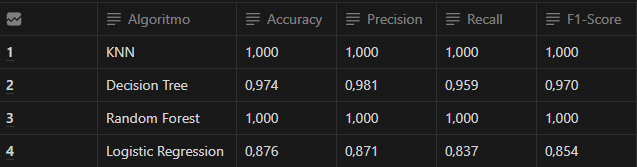
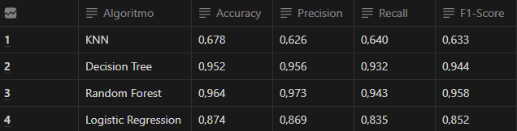
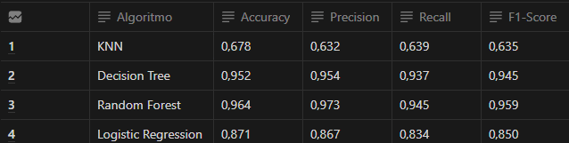
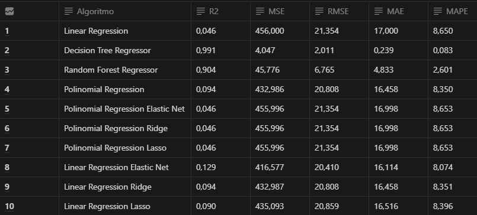
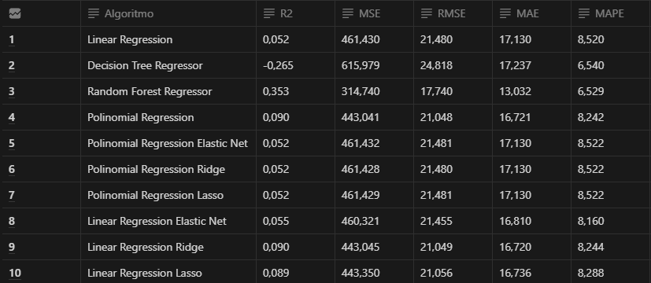
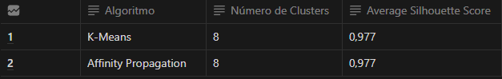

# Machine Learning Test

## Description
Data Money believes that the expertise in training and fine-tuning algorithms, carried out by the company's Data Scientists, is the main reason for the excellent results that the consultancies have been delivering to their clients.

## Objective
The objective of this project will be to perform tests with Classification, Regression and Clustering algorithms, to study the change in performance behavior, as the values ​​of the main overfitting and underfitting control parameters change.

# Solution planning
## Final product
The final product will be 7 tables showing the performance of the algorithms, evaluated using multiple metrics, for 3 different data sets: Training, validation and testing.

## Tested algorithms
### Classification:
Algorithms: KNN, Decision Tree, Random Forest and Logistic Regression
Performance metrics: Accuracy, Precision, Recall and F1-Score

### Regression:
Algorithms: Linear Regression, Decision Tree Regressor, Random Forest
Regressor, Polynomial Regression, Linear Regression Lasso, Linear
Regression Ridge, Linear Regression Elastic Net, Polynomial Regression
Lasso, Polynomial Regression Ridge and Polynomial Regression Elastic Net
Performance metrics: R2, MSE, RMSE, MAE and MAPE

### Clustering:
Algorithms: K-Means and Affinity Propagation
Performance metrics: Silhouette Score

## Tools used
Python 3.8 and Scikit-learn

# Development
## Solution strategy
For the purpose of test the Machine Learning algorithms, I will write the codes using Python to train each of the algorithms and I will vary their main overfitting adjustment parameters and observe the final metric. The set of values ​​that make the algorithms achieve the best performance will be those chosen for the final training of the algorithm. ## Step by step Step 1: Split the data into training, testing and validation. Step 2: Training the algorithms with the training data, using the “default” parameters. Step 3: Measure the performance of the algorithms trained with the default parameter, using the training data set. Step 4: Measure the performance of the algorithms trained with the “default” parameter, using the validation data set. Step 5: Alternate the values ​​of the main parameters that control the algorithm’s overfitting until finding the set of parameters that presents the best performance of the algorithms. Step 6: Merge the training and validation data
Step 7: Retrain the algorithm by merging the training and validation data, using the best values ​​for the algorithm control parameters.
Step 8: Measure the performance of the algorithms trained with the best parameters, using the test data set.
Step 9: Evaluate the tests and note the top 3 Insights that stood out.

# Top 3 Insights
### Insight Top 1
Tree-based algorithms have better performance in all metrics, when applied to the test data, in the Classification test.

## Insight Top 2
The performance of the classification algorithms on the validation data was very close to the performance on the test data.

## Insight Top 3
All regression algorithms did not present good performance metrics, which shows a need for attribute selection
and better preparation of the independent variables of the data set.

# Results
## Classification test:
### About the training data

### About the validation data

### About the test data

## Regression test:
### About the training data

### About the validation data

### About the test data test

## Clustering test:

# Conclusion
In this Machine Learning test, I was able to gain experience and better understand the limits of algorithms between the states of underfitting and overfitting.
Tree-based algorithms are sensitive to the depth of growth and the number of trees in the forest, making the correct choice of the values ​​of these parameters prevent the algorithms from entering the overfitting state.
Regression algorithms, on the other hand, are sensitive to the degree of the polynomial. This parameter controls the limit between the underfitting and overfitting states of these algorithms.
This Machine Learning test was very important to deepen the understanding of how several classification, regression and clustering algorithms work.
o and what are the main control parameters between the underfitting and overfitting states.

# Next steps
As the next steps of this essay, I intend to test new Machine Learning algorithms and use different data sets to increase knowledge about the algorithms and which scenarios are most favorable for increasing their performance.
